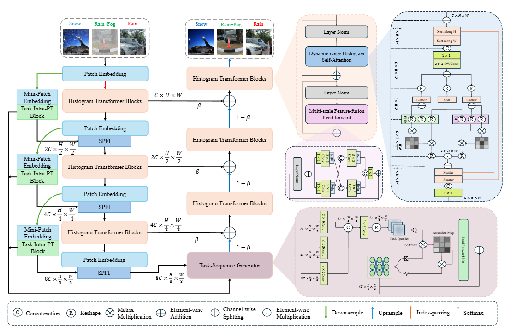

# Multi-Weather Image Restoration via Histogram-Based Transformer Feature Enhancement

## **Overview**



## **Getting Started**

---

1. Clone repo

```jsx
git clone https://github.com/iaslay/Removeweather.git
cd Removeweather
```

1. Create and activate a new conda environment

```jsx
conda create -n Removeweather python=3.9.13
conda activate Removeweather
```

1. Install dependent packages

```jsx
pip install --upgrade pip
pip install -r requirements.txt
```

## **Data Preparation**

---

**Train Data:**

TransWeather is trained on a combination of images sampled from Outdoor-Rain, Snow100K, and Raindrop datasets (similar to [All-in-One (CVPR 2020)](https://openaccess.thecvf.com/content_CVPR_2020/papers/Li_All_in_One_Bad_Weather_Removal_Using_Architectural_Search_CVPR_2020_paper.pdf)), dubbed as "All-Weather", containing 18069 images. It can be downloaded from this [link](https://drive.google.com/file/d/1tfeBnjZX1wIhIFPl6HOzzOKOyo0GdGHl/view?usp=sharing).

**Test Data:**

RainDrop Test : [Link](https://drive.google.com/open?id=1e7R76s6vwUJxILOcAsthgDLPSnOrQ49K) (Note that Test A is used for quantitative evaluation across all papers in the community, Test B is used for additional qualitative analysis)

Snow100K Test : [Link](https://sites.google.com/view/yunfuliu/desnownet) (We use the Snow100K-L distribution for testing)

Test1 (validation set of "Outdoor-Rain") : [Link](https://drive.google.com/file/d/1pd90tVF326s1JllhuUEKiATyFa3aPjzH/view?usp=sharing)

Real World Images : [Link](https://github.com/lsy17096535/Single-Image-Deraining)

**Dataset format:**

Download the datasets and arrange them in the following format. T

```
----Removeweather
    |----data
    |    |----snow
    |    |    |----snow
    |    |    |    |----input
    |    |    |    |----gt
    |    |    |    |----
    |    |----allweather
    |    |    |----input
    |    |    |----gt\
    |    |----test_b
    |    |    |----test_b
    |    |    |    |----input
    |    |    |    |----gt
    |    |----test1
    |    |    |----test1
    |    |    |    |----input
    |    |    |    |----gt
    |    |----test_a
    |    |    |----test_a
    |    |    |    |----input
    |    |    |    |----gt
    |    |----real_rain+mist
```

## **Training&Testing**

---

**Training：**

```makefile
cd code
python train.py --device_idx <device_idx> 
```

**Testing：**

```makefile
cd code
python test.py --device_idx <device_idx> --checkpoint <checkpoint>
python test1.py --device_idx <device_idx> --checkpoint <checkpoint> 
python test_snow.py --device_idx <device_idx> --checkpoint <checkpoint>  
```

### **Pretrained Models**

---

Download pretrained models from [here](https://drive.google.com/file/d/1p-0lPdcsgwUQ5SgNBQsXjGgdMO2lLAd1/view?usp=sharing) and put them in folder `save_data/`